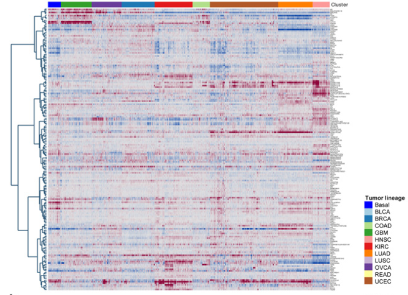

```{r, include = FALSE}
knitr::opts_chunk$set(
  collapse = TRUE,
  comment = "#>"
)
```

```{r setup}
library(clusterProb)
```

### Another Example of the `clusterProb` Package
This document will provide an additional example of the utillity of `clusterProb` package. The package will be used to analyze the pan-cancer data set from Rehan Akbani's "A pan-cancer proteomic perspective on The Cancer Genome Atlas." The data set includes Proteomic data from 3,467 patient tumors obtained from TCGA, including:
747 breast (BRCA)
464 colon and rectal adenocarcinoma (COAD and READ)
454 renal clear cell carcinoma (KIRC)
412 high-grade serous ovarian cystadenocarcinoma (OVCA)
404 uterine corpus endometrial carcinoma (UCEC)
237 lung adenocarcinoma (LUAD)
212 head and neck squamous cell carcinoma (HNSC)
195 lung squamous cell carcinoma (LUSC)
127 bladder urothelial carcinoma (BLCA)
215 glioblastoma multiforme (GBM) 
The paper includes a heat map that clusters the tumors based on their lineage. It is shown below.



### Data Formatting
First, the  data is loaded from the `clusterProb` package. The numeric values are extracted and saved in an object called `num_dat`, in which the rows are the samples and the columns are the proteins. Akbani's paper did not describe any data normalization, so none will be performed here.

```{r data, echo=TRUE}
# Read data
dat  <- clusterProb::pan_cancer_data
num_dat <- dat[ , 7:187]
rownames(num_dat) <- dat$TCGA_ID
```

### Clustering
The data is clustered using spearman correlation and Ward's linkage, as described by Akbani. The clustering results are saved in an object called `hdat`.
```{r clustering, echo=TRUE}
# Clustering
cor_dat <- cor(t(num_dat), method = "spearman")
cor_dat = 1 - cor_dat
cor_dat = as.dist(cor_dat)
hdat <- hclust(cor_dat, method = "ward.D2")
```

### Cluster Probabilities and Heatmap
The `cluster_prob` function is used to train a random forest model on the data. The model treats the genes as features and the clustering labels from `hdat` as outcomes. The `cluster_prob` function also enables the user to calculate feature importance, which will be used to select important genes for the heatmap. The output is a list containig the cluster probabilities and importance calculations, which can then be passed to the `heatmap` function. Note that the user can specify the expression range of the heatmap.

```{r clusterProb, echo=TRUE}
prob_result <- cluster_prob(num_dat, hdat, 8, 500, 50)
heatmap_prob(prob_result, -2.5, 2.5)
