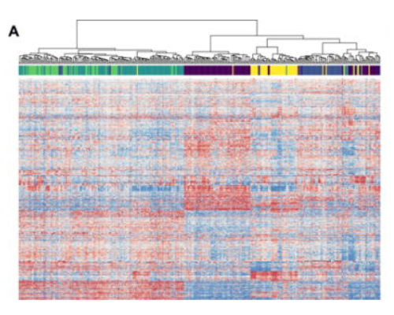

```{r, include = FALSE}
knitr::opts_chunk$set(
  collapse = TRUE,
  comment = "#>"
)
```

```{r setup}
library(clusterProb)
```

## An Example of the `clusterProb` Package

In this document, the `clusterProb` package will be used to analyze the UNC337 data set from Patrick Kimes' "Statistical Significance for Hierarchical Clustering." This data set includes gene expression data from 337 breast cancer patients in the University of North Carolina Microarray Database (https://genome.unc.edu/pubsup/clow/). In his paper, Kimes perforsms hierarchical clustering on the data to identify breast cancer subtypes within the patients. He displays his results in the heatmap below.



### Formatting data
First, the data set is loaded from the `clusterProb` package. The numeric values are extracted and stored in an matrix called `gene_dat`, in which the rows are the genes and the columns are the patients. The `gene_dat` matrix is then normalized using the `scale function`. Finally, the gene data is transposed, so that the rows are the patients and the columns are the genes. This step is important for the clustering and model fitting.

```{r data, echo=TRUE}
dat <- clusterProb::unc_breast_data
gene_dat <- as.matrix(dat[7:1671 , 5:341])
gene_dat <- apply(gene_dat, 2, as.numeric)
rownames(gene_dat) <- as.character(dat[7:1671, 3])

gene_dat = scale(gene_dat)
t_dat = t(gene_dat)
```

### Clustering
Hierarchical clustering is performed on the data using euclidean distance metric and Ward's linkage, as describe in Kimes' paper. The clustering results are saved in an object named `hdat`.

```{r clustering, echo=TRUE}
hdat = hclust(dist(t_dat), method = "ward.D2")
```

### Cluster Probabilities and Heat Map
The `cluster_prob` function is used to train a random forest model on the data. The model uses the genes as features and the clustering labels from `hdat` as outcomes. The `cluster_prob` function also enables the user to calculate feature importance, which will be used to select important genes for the heatmap. The output is a list containig the cluster probabilities and feature importances, which can then be passed to the `heatmap_prob` function. Note that the user can specify the expression range of the heatmap.

``` {r cluster_prob, echo=TRUE}
prob_result <- cluster_prob(t_dat, hdat, 5, 200, 50)
heatmap_prob(prob_result, -2, 2)
```
